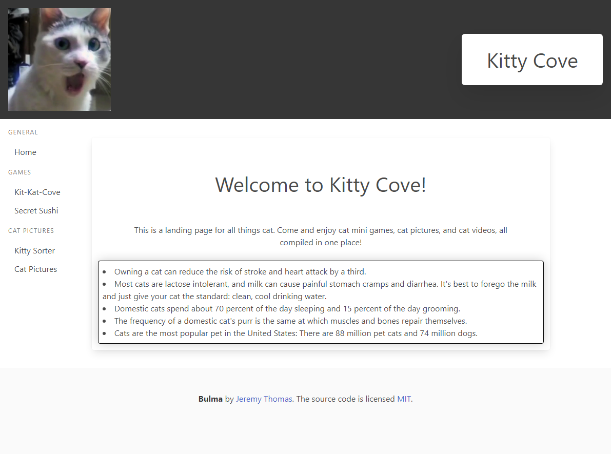

# Kitty-Cove

## Description
This is a project made by Kurtis (RuckusEnjoyer), Matthew (greenStone83), and Chris (ChrisGaye). It is a website for all things cat related! Games, pictures, videos, cat facts, you will find it all here.

## Features
- Kit-Kat-Kove, a kitty version of Tic-Tac-Toe
- Secret Sushi, a game where you find hidden sushi
- Kitty Sorter, a tier list creator for cat pictures
- Cat Pictures, randomly generated cat pictures for your pleasure

## Screenshot

## Credits
Code Source for Draggables:
https://www.geeksforgeeks.org/html-drag-and-drop/#

Image Source for Sushi Game Cursor:
https://www.freeiconspng.com/img/40363

Image Source for Kitty Cove Navbar Image:
https://pyxis.nymag.com/v1/imgs/d29/4a6/d8b19f15856697769dc1c586d59ce82bd8-22-cat-video-truth-smoking.rsquare.w700.jpg

Image sources for Kit Kat Kove
https://iconduck.com/emojis/36469/cat-face
https://iconduck.com/emojis/16882/smiling-cat-face-with-open-mouth

## Link
https://ruckusenjoyer.github.io/Kitty-Cove/index.html